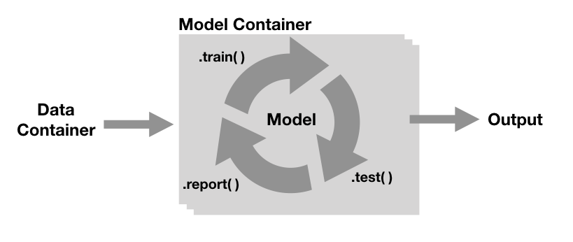

```{r setup, include=FALSE}
knitr::opts_chunk$set(echo = T, eval = T, message = F, warning = F, error = F)
```

```{r, echo = F, results='asis'}
library(badger)
cat(
	badge_code_size("systats/deeplyr"),
	badge_last_commit("systats/deeplyr")
)
```

This is a light-weight model engine mainly for text classification tasks written as R6class. While Keras, XGBoost or Ranger (RF) provide high quality learners, `deeplyr` comes with unifying train/test/report functions for all backends mentioned. This streamlined data/ model worklfow does automatically 

* log (thanks to [`trackR`](https://github.com/daroczig/logger)), 
* benchmark (thanks to [`tictoc`]() and [`Metrics`]())
* optimize over hyperparameter spaces. 


# Other stuff

* a roadmap for improved NLP decisions focussing on different outcomes (fortcomming).
* shinyapp for monitoring model performances.


## Workflow




# Options

```{r, eval = F}
# keras::install_keras()
# tensorflow::install_tensorflow()
# py_config()
# use_python("/anaconda3/lib/python3.7")
# py_install("tensorflow")
# Sys.getenv("RETICULATE_PYTHON")
```


```{bash, eval = F}
echo "Sys.setenv(RETICULATE_PYTHON = '~/usr/local/bin/python3')" > ~/.Rprofile
```

```{bash, eval = F}
nano ~/.Rprofile
```


# Data

```{r, eval = F}
load("projects/dev-predict-participation/data/batches/tweets_batched_250.Rdata")
sample_dat <- tweets_batched %>%
  mutate(party_binary = case_when(party == "rep" ~ 1, party == "dem" ~ 0)) %>%
  select(linear = theta, binary = party_binary, category = race, lemma) %>%
  sample_n(100000) %>%
  glimpse

#save(sample_dat, file = "sample_100000.Rdata")
```


# Eval

```{r, eval = F}
dir("models/0a1505ace1d5ee9fb9a1191357b94865/")
pred <- get(load("models/0a1505ace1d5ee9fb9a1191357b94865/model_preds.Rdata"))
pred %>% glimpse
```

