deeplyr
================

[](https://github.com/systats/deeplyr)
[](https://github.com/systats/deeplyr/commits/master)

This is a light-weight model engine mainly for text classification tasks
written as R6class. While Keras, XGBoost or Ranger (RF) provide high
quality learners, `deeplyr` comes with unifying train/test/report
functions for all backends mentioned. This streamlined data/ model
worklfow does automatically

  - log (thanks to [`trackR`](https://github.com/daroczig/logger)),
  - benchmark (thanks to [`tictoc`]() and [`Metrics`]())
  - optimize over hyperparameter spaces.

# Other stuff

  - a roadmap for improved NLP decisions focussing on different outcomes
    (fortcomming).
  - shinyapp for monitoring model performances.

## Workflow


# Packages

``` r
pacman::p_load(devtools, R6, tidyverse, purrr, furrr, RSQLite, 
      # GA, dials,
      jsonlite, text2vec, keras, reticulate,
      plotROC, alluvial, ggforce, ggalluvial, ggparallel, survminer, survival)

options(scipen = 999)
devtools::load_all()
# devtools::document()
```

# Data

## DTM

``` r
dparams <- list(
  data_path = "sample_dat.Rdata",
  text = "lemma",
  input_dim = 2000,
  seq_len = 150,
  term_count_min = 5,
  doc_proportion_max  = .1
)

# plan(multiprocess, workers = 4)
# options(future.globals.maxSize = 1024^4)
dc <- create_dtm_container(dparams)
```

    ## [1] 10000

``` r
dc$report()
#dc$get_param()
```

## Seqences

``` r
dparams <- list(
  data_path = "sample_dat.Rdata",
  text = "lemma",
  input_dim = 5000,
  seq_len = 150,
  term_count_min = 5,
  doc_proportion_max  = .1 
)

# plan(multiprocess, workers = 4)
# options(future.globals.maxSize = 1024^4)
dc_seq <- create_seq_container(dparams)
```

    ## [1] 10000

``` r
# dc$report()
#dc_seq
```

# Backends

## Ranger (RF)

``` r
devtools::document()
```

    ## Writing NAMESPACE
    ## Writing NAMESPACE

``` r
mparams <- list(
  output_dim = 1,
  target = "binary"
)

jo <- deeplyr::learner$new("ranger:binary")
jo$set_param(mparams)
jo$set_data(dc)
jo$split(oos = F, val = F)

jo$train()
```

    ## Growing trees.. Progress: 79%. Estimated remaining time: 8 seconds.
    ## 41.468 sec elapsed

``` r
jo$test(dev = F)
s <- jo$report()

jo$glimpse()
```

    ## [[1]]
    ## # A tibble: 1,468 x 9
    ##     prob  pred  linear binary category lemma          ids target model_id  
    ##    <dbl> <dbl>   <dbl>  <dbl> <chr>    <chr>        <int>  <dbl> <chr>     
    ##  1 0.338     0 -0.0269      1 hispanic rt @ richar…  4305      1 80fb4f68a…
    ##  2 0.261     0 -0.683       0 hispanic "rt @ nbcpo…  5440      0 80fb4f68a…
    ##  3 0.307     0 -0.129       0 white    rt @ softsa…  7229      0 80fb4f68a…
    ##  4 0.651     1  0.683       0 white    "@sdebbieha…  9155      0 80fb4f68a…
    ##  5 0.241     0  0.742       0 white    rt @ kamala…  3327      0 80fb4f68a…
    ##  6 0.445     0  2.11        0 white    rt @ mayorl…  8822      0 80fb4f68a…
    ##  7 0.308     0  0.492       1 white    everything …  6846      1 80fb4f68a…
    ##  8 0.385     0 -0.671       1 white    rt @ popula…  7923      1 80fb4f68a…
    ##  9 0.256     0  0.0294      0 white    rt @ thesta…  9900      0 80fb4f68a…
    ## 10 0.375     0  0.785       0 white    @achowell20…  7866      0 80fb4f68a…
    ## # … with 1,458 more rows
    ## 
    ## [[2]]
    ## # A tibble: 1 x 7
    ##      ll logloss   auc precision recall fbeta_score accuracy
    ##   <dbl>   <dbl> <dbl>     <dbl>  <dbl>       <dbl>    <dbl>
    ## 1  1.09     Inf 0.632     0.606  0.398       0.480    0.646
    ## 
    ## [[3]]
    ## # A tibble: 1 x 19
    ##   model_name output_dim target data_id data_name text  input_dim seq_len
    ##   <chr>           <dbl> <chr>  <chr>   <chr>     <chr>     <int>   <dbl>
    ## 1 ranger              1 binary 355760… sample_d… lemma      2000     150
    ## # … with 11 more variables: term_count_min <dbl>,
    ## #   doc_proportion_max <dbl>, total_size <int>, data_path <chr>,
    ## #   train_size <int>, test_size <int>, split_mode <S3: glue>,
    ## #   model_id <chr>, duration <dbl>, metrics <list>, timestamp <chr>
    ## 
    ## [[4]]
    ## [[4]]$roc

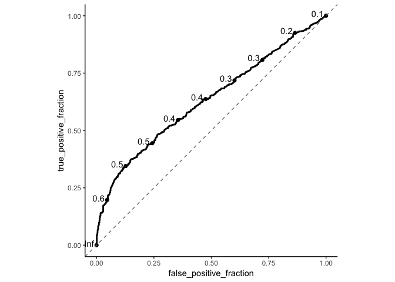<!-- -->

    ## 
    ## [[4]]$confusion

<!-- -->

    ## 
    ## [[4]]$sankey

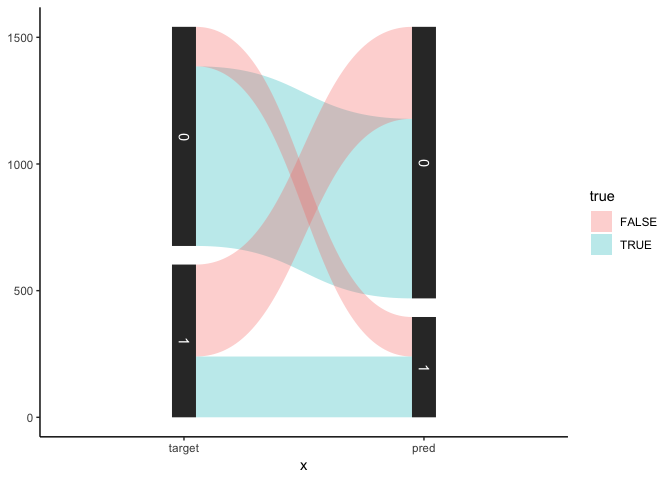<!-- -->

    ## 
    ## [[4]]$prob

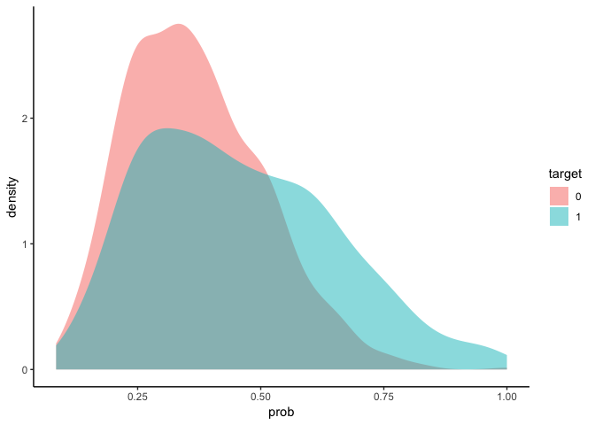<!-- -->

    ## 
    ## [[4]]$surv

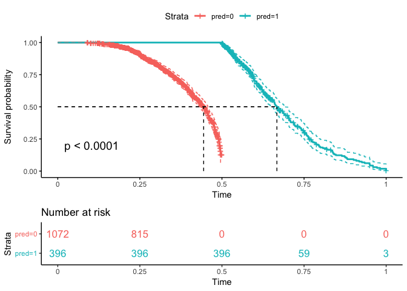<!-- -->

``` r
# jo$predict_dtm("make america great again! maga")
```

## XGBoost

``` r
#devtools::document()
mparams <- list(
  output_dim = 1,
  target = "binary"
)

jo <- deeplyr::learner$new("xgboost:binary")
jo$set_param(mparams)
jo$set_data(dc)
jo$split(oos = F, val = F)

jo$train()
```

    ## [1]  train-error:0.372896 
    ## Will train until train_error hasn't improved in 5 rounds.
    ## 
    ## [2]  train-error:0.362290 
    ## [3]  train-error:0.355387 
    ## [4]  train-error:0.349663 
    ## [5]  train-error:0.347811 
    ## [6]  train-error:0.343098 
    ## [7]  train-error:0.341582 
    ## [8]  train-error:0.337710 
    ## [9]  train-error:0.336869 
    ## [10] train-error:0.333333 
    ## [11] train-error:0.333333 
    ## [12] train-error:0.331481 
    ## [13] train-error:0.329630 
    ## [14] train-error:0.327778 
    ## [15] train-error:0.324579 
    ## [16] train-error:0.323737 
    ## [17] train-error:0.321549 
    ## [18] train-error:0.320707 
    ## [19] train-error:0.318013 
    ## [20] train-error:0.316835 
    ## [21] train-error:0.315152 
    ## [22] train-error:0.313300 
    ## [23] train-error:0.313131 
    ## [24] train-error:0.311785 
    ## [25] train-error:0.310606 
    ## [26] train-error:0.307576 
    ## [27] train-error:0.304040 
    ## [28] train-error:0.302189 
    ## [29] train-error:0.301515 
    ## [30] train-error:0.301010 
    ## [31] train-error:0.300842 
    ## [32] train-error:0.299495 
    ## [33] train-error:0.297643 
    ## [34] train-error:0.295960 
    ## [35] train-error:0.294613 
    ## [36] train-error:0.292929 
    ## [37] train-error:0.291414 
    ## [38] train-error:0.289899 
    ## [39] train-error:0.288552 
    ## [40] train-error:0.287205 
    ## [41] train-error:0.286364 
    ## [42] train-error:0.285185 
    ## [43] train-error:0.282828 
    ## [44] train-error:0.281650 
    ## [45] train-error:0.280808 
    ## [46] train-error:0.281313 
    ## [47] train-error:0.280640 
    ## [48] train-error:0.279630 
    ## [49] train-error:0.277609 
    ## [50] train-error:0.276431 
    ## [51] train-error:0.276094 
    ## [52] train-error:0.275084 
    ## [53] train-error:0.272727 
    ## [54] train-error:0.272727 
    ## [55] train-error:0.272054 
    ## [56] train-error:0.272391 
    ## [57] train-error:0.271380 
    ## [58] train-error:0.270539 
    ## [59] train-error:0.268687 
    ## [60] train-error:0.267340 
    ## [61] train-error:0.266162 
    ## [62] train-error:0.265152 
    ## [63] train-error:0.264141 
    ## [64] train-error:0.263636 
    ## [65] train-error:0.263131 
    ## [66] train-error:0.261785 
    ## [67] train-error:0.262458 
    ## [68] train-error:0.262121 
    ## [69] train-error:0.261448 
    ## [70] train-error:0.260606 
    ## [71] train-error:0.260774 
    ## [72] train-error:0.259764 
    ## [73] train-error:0.258923 
    ## [74] train-error:0.258586 
    ## [75] train-error:0.258249 
    ## [76] train-error:0.257912 
    ## [77] train-error:0.257744 
    ## [78] train-error:0.256397 
    ## [79] train-error:0.255556 
    ## [80] train-error:0.254545 
    ## [81] train-error:0.253704 
    ## [82] train-error:0.253367 
    ## [83] train-error:0.253030 
    ## [84] train-error:0.251347 
    ## [85] train-error:0.248822 
    ## [86] train-error:0.248485 
    ## [87] train-error:0.247980 
    ## [88] train-error:0.248485 
    ## [89] train-error:0.248148 
    ## [90] train-error:0.247643 
    ## [91] train-error:0.247306 
    ## [92] train-error:0.247475 
    ## [93] train-error:0.247138 
    ## [94] train-error:0.247306 
    ## [95] train-error:0.247306 
    ## [96] train-error:0.246128 
    ## [97] train-error:0.245791 
    ## [98] train-error:0.244781 
    ## [99] train-error:0.245118 
    ## [100]    train-error:0.244276 
    ## 60.389 sec elapsed

``` r
jo$test(dev = F)
jo$test()
s <- jo$report()

jo$glimpse()
```

    ## [[1]]
    ## # A tibble: 1,518 x 9
    ##     prob  pred  linear binary category lemma          ids target model_id  
    ##    <dbl> <dbl>   <dbl>  <dbl> <chr>    <chr>        <int>  <dbl> <chr>     
    ##  1 0.375     0 -0.0269      1 hispanic rt @ richar…  4305      1 5a34103fa…
    ##  2 0.375     0 -0.132       0 hispanic rt @ talalx…  3938      0 5a34103fa…
    ##  3 0.339     0  0.524       0 black    rt @ bonerw…  7057      0 5a34103fa…
    ##  4 0.528     1  2.12        1 white    rt @bsidesl…  2093      1 5a34103fa…
    ##  5 0.375     0  1.59        0 white    thank you h…   639      0 5a34103fa…
    ##  6 0.298     0  0.936       0 white    @paulkrugma…  1398      0 5a34103fa…
    ##  7 0.370     0  0.275       0 white    rt @ topher…  4779      0 5a34103fa…
    ##  8 0.132     0  0.0974      0 asian    rt brixsnt …  4920      0 5a34103fa…
    ##  9 0.661     1  0.577       1 white    @yashar @ a…  4336      1 5a34103fa…
    ## 10 0.346     0  0.533       0 hispanic rt @ thedai…  4501      0 5a34103fa…
    ## # … with 1,508 more rows
    ## 
    ## [[2]]
    ## # A tibble: 1 x 7
    ##      ll logloss   auc precision recall fbeta_score accuracy
    ##   <dbl>   <dbl> <dbl>     <dbl>  <dbl>       <dbl>    <dbl>
    ## 1 0.982   0.624 0.657     0.670  0.311       0.425    0.663
    ## 
    ## [[3]]
    ## # A tibble: 1 x 20
    ##   model_name objective output_dim target data_id data_name text  input_dim
    ##   <chr>      <chr>          <dbl> <chr>  <chr>   <chr>     <chr>     <int>
    ## 1 xgboost    binary:l…          1 binary 355760… sample_d… lemma      2000
    ## # … with 12 more variables: seq_len <dbl>, term_count_min <dbl>,
    ## #   doc_proportion_max <dbl>, total_size <int>, data_path <chr>,
    ## #   train_size <int>, test_size <int>, split_mode <S3: glue>,
    ## #   model_id <chr>, duration <dbl>, metrics <list>, timestamp <chr>
    ## 
    ## [[4]]
    ## [[4]]$roc

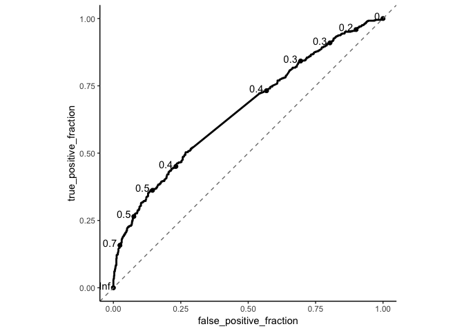<!-- -->

    ## 
    ## [[4]]$confusion

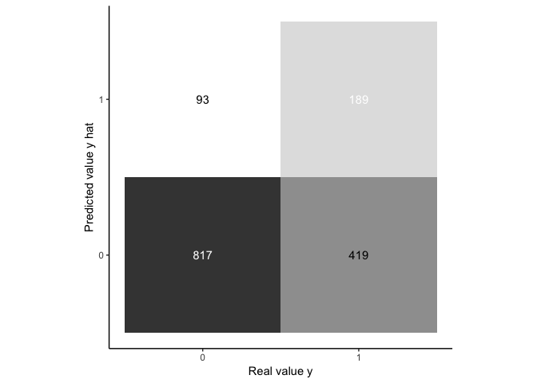<!-- -->

    ## 
    ## [[4]]$sankey

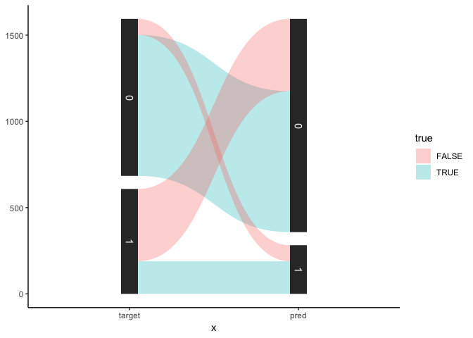<!-- -->

    ## 
    ## [[4]]$prob

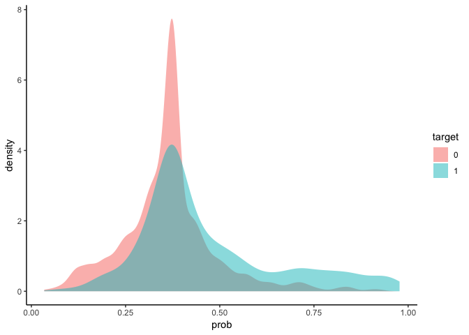<!-- -->

    ## 
    ## [[4]]$surv

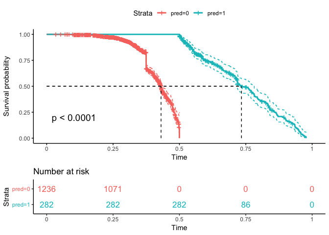<!-- -->

## Keras

``` r
devtools::document()
```

    ## Writing NAMESPACE
    ## Writing NAMESPACE

``` r
model_params <- list(
  epochs = 1,
  embed_dim = 128,
  output_dim = 1, 
  output_fun = "sigmoid", 
  loss = "binary_crossentropy", 
  optimizer = "adam", 
  metrics = "accuracy",
  target = "binary",
  model = deeplyr::keras_multi_cnn,
  model_name = "multi_cnn"
)

jo <- deeplyr::learner$new("keras:binary")
jo$set_param(model_params)
jo$set_data(dc_seq)
jo$split(oos = F, val = T)

jo$train()
```

    ## 9.586 sec elapsed

``` r
jo$test(dev = F)
s <- jo$report()

jo$glimpse()
```

    ## [[1]]
    ## # A tibble: 753 x 9
    ##     prob  pred  linear binary category lemma          ids target model_id  
    ##    <dbl> <dbl>   <dbl>  <dbl> <chr>    <chr>        <int>  <dbl> <chr>     
    ##  1 0.409     0  0.0215      1 white    "drew : \" …  6108      1 748ef997b…
    ##  2 0.441     0 -0.805       0 hispanic rt @ codyqu…  3228      0 748ef997b…
    ##  3 0.420     0  0.0420      1 white    rt @ breaki…  3178      1 748ef997b…
    ##  4 0.420     0 -0.341       1 white    @stormisupo…  3447      1 748ef997b…
    ##  5 0.442     0  0.513       1 white    great job @…   539      1 748ef997b…
    ##  6 0.424     0  1.59        0 white    rt @jameela…   351      0 748ef997b…
    ##  7 0.431     0  0.784       0 white    rt @ sahluw…  7911      0 748ef997b…
    ##  8 0.396     0 -0.817       0 black    rt @ andrea…  5754      0 748ef997b…
    ##  9 0.404     0  1.17        0 white    rt @ 2concu…  9166      0 748ef997b…
    ## 10 0.407     0 -0.856       1 hispanic rt @ jadeoh…  8291      1 748ef997b…
    ## # … with 743 more rows
    ## 
    ## [[2]]
    ## # A tibble: 1 x 7
    ##      ll logloss   auc precision recall fbeta_score accuracy
    ##   <dbl>   <dbl> <dbl>     <dbl>  <dbl>       <dbl>    <dbl>
    ## 1 0.894   0.672 0.605       0.8 0.0127      0.0249    0.584
    ## 
    ## [[3]]
    ## # A tibble: 1 x 25
    ##   output_fun loss  metrics optimizer epochs embed_dim output_dim target
    ##   <chr>      <chr> <list>  <chr>      <dbl>     <dbl>      <dbl> <chr> 
    ## 1 sigmoid    bina… <tibbl… adam           1       128          1 binary
    ## # … with 17 more variables: model_name <chr>, data_name <chr>, text <chr>,
    ## #   input_dim <int>, seq_len <dbl>, term_count_min <dbl>,
    ## #   doc_proportion_max <dbl>, total_size <int>, data_path <chr>,
    ## #   train_size <int>, test_size <int>, val_size <int>, split_mode <S3:
    ## #   glue>, model_id <chr>, n_filters <dbl>, duration <dbl>,
    ## #   timestamp <chr>
    ## 
    ## [[4]]
    ## [[4]]$roc

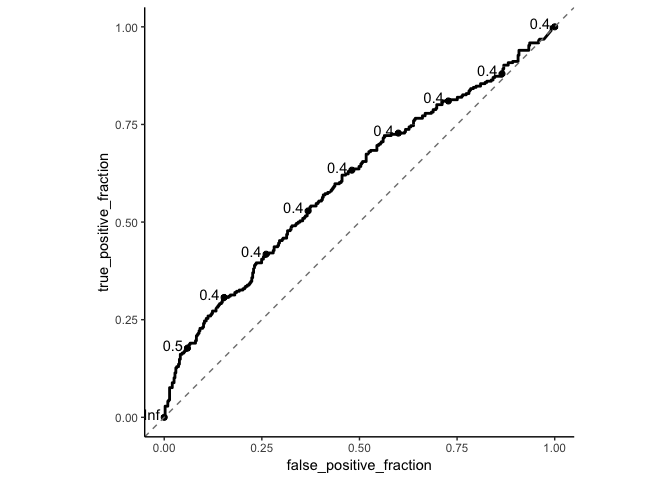<!-- -->

    ## 
    ## [[4]]$confusion

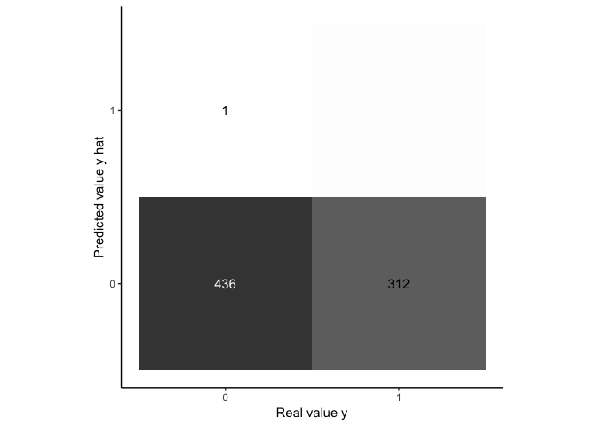<!-- -->

    ## 
    ## [[4]]$sankey

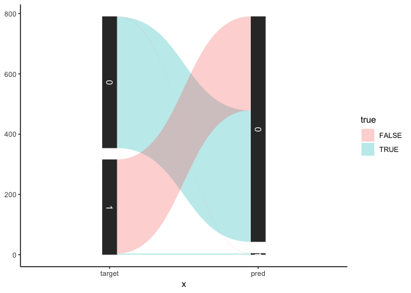<!-- -->

    ## 
    ## [[4]]$prob

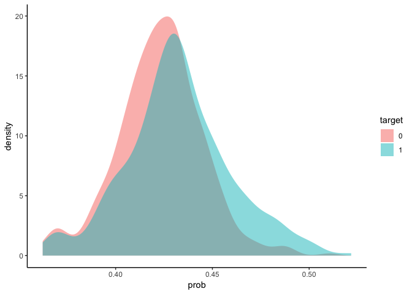<!-- -->

    ## 
    ## [[4]]$surv

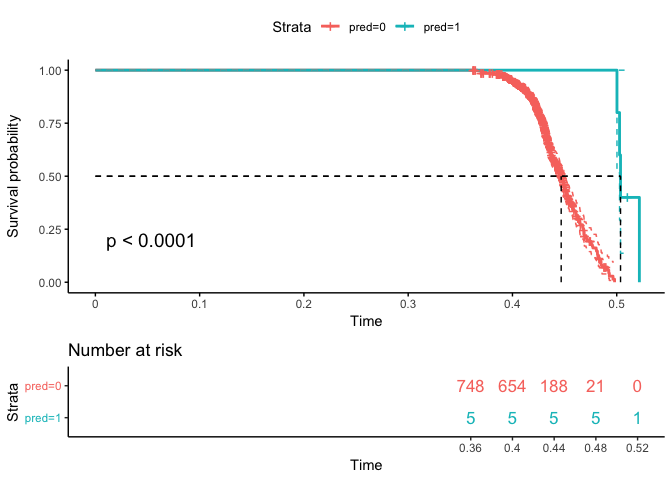<!-- -->

# Options

``` r
# keras::install_keras()
# tensorflow::install_tensorflow()
# py_config()
# use_python("/anaconda3/lib/python3.7")
# py_install("tensorflow")
# Sys.getenv("RETICULATE_PYTHON")
```

``` bash
echo "Sys.setenv(RETICULATE_PYTHON = '~/usr/local/bin/python3')" > ~/.Rprofile
```

``` bash
nano ~/.Rprofile
```

# Data

``` r
# load("projects/dev-predict-participation/data/final_tweets.Rdata")
# sample_dat <- final_tweets %>% 
#   mutate(party_binary = case_when(party == "rep" ~ 1, party == "dem" ~ 0)) %>%
#   select(linear = theta, binary = party_binary, category = race, lemma) %>% 
#   sample_n(10000) %>% 
#   glimpse
# 
# save(sample_dat, file = "sample_dat.Rdata")
```

# Eval

``` r
dir("models/0a1505ace1d5ee9fb9a1191357b94865/")
```

    ## [1] "model_container.Rdata" "model_param.json"      "model_preds.Rdata"

``` r
pred <- get(load("models/0a1505ace1d5ee9fb9a1191357b94865/model_preds.Rdata"))
pred %>% glimpse
```

    ## Observations: 1,463
    ## Variables: 9
    ## $ prob     <dbl> 0.8277852, 0.6895484, 0.3037556, 0.5316168, 0.5087431, …
    ## $ pred     <dbl> 1, 1, 0, 1, 1, 0, 0, 0, 1, 1, 1, 1, 0, 0, 0, 1, 1, 0, 0…
    ## $ linear   <dbl> -1.08242461, 0.32996741, 0.03372755, 0.25603945, -0.304…
    ## $ binary   <dbl> 1, 1, 0, 0, 0, 1, 0, 0, 1, 1, 1, 0, 0, 0, 0, 1, 0, 0, 0…
    ## $ category <chr> "white", "multi", "white", "white", "black", "white", "…
    ## $ lemma    <chr> "awesome lrihendry well we ’ll . @ dbongino @realdonald…
    ## $ ids      <int> 3600, 6399, 9901, 798, 1241, 7463, 4679, 4724, 7041, 80…
    ## $ target   <dbl> 1, 1, 0, 0, 0, 1, 0, 0, 1, 1, 1, 0, 0, 0, 0, 1, 0, 0, 0…
    ## $ model_id <chr> "0a1505ace1d5ee9fb9a1191357b94865", "0a1505ace1d5ee9fb9…

## Binary

``` r
devtools::document()
```

    ## Writing NAMESPACE
    ## Writing NAMESPACE
